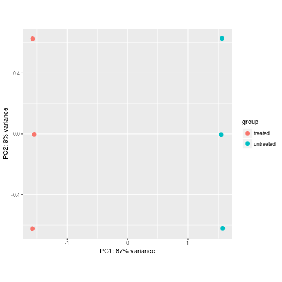
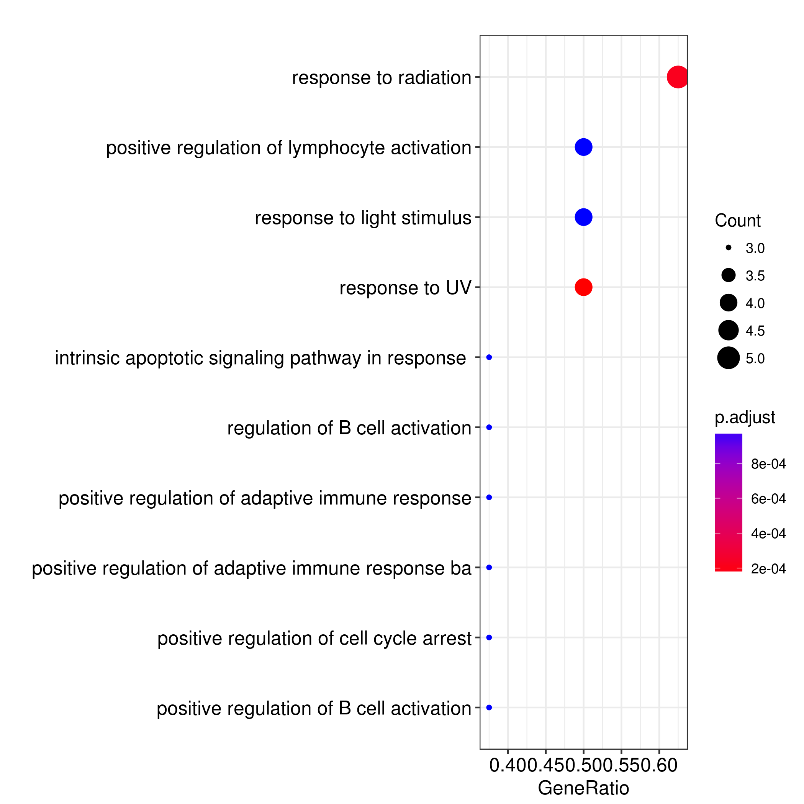

# rnaSeq-byBABS

A Nextflow pipeline script for processing RNA-Seq data.

by BABS - [The Bioinformatics & Biostatistics Group][url_babs] @ [The Francis Crick Institute][url_crick]

nextflow: [http://www.nextflow.io][url_nextflow]
nextflow-quickstart: [http://www.nextflow.io/docs/latest/getstarted.html#get-started][url_nextflow_tuto]

## Overview

To run an rnaSeq-byBABS analysis you need to complete the following steps.
These are explained in more detail further down.

1) Load Nextflow module.
2) Obtain the rnaSeq-byBABS files you need.
3) Specify analysis parameters by completing the parameters.yml file.
4) Create a sample design file and comparisons contrasts file.
5) Run nextflow pipeline.

## The test data

You can test the pipeline by using the provided simulated test dataset.
Running the pipeline on it should take no more than **15 minutes**.
In the following, this dataset will be used as an example to illustrate how you can parametrise the pipeline for a real experiment.

## Obtaining the Files You Need

	$ git clone https://github.com/crickbabs/rnaSeq_byBABS
	$ cd rnaSeq_byBABS

These files should be in the current directory:

|File|Description|
|---|---|
|`README.md`|this file|
|`rnaSeq-byBABS.nf`|the nextflow script itself|
|`fastq/single_end/`|the directory containing simulated single-end `fastq.gz` samples|
|`fastq/paired_end/`|the directory containing simulated paired-end `fastq.gz` samples|
|`yml/single_end.yml`|the example parameter file for the simulated single-end samples|
|`yml/paired_end.yml`|the example parameter file for the simulated paired-end samples|
|`yml/modules.yml`|the configuration file containing the slurm modules to load|
|`yml/multiqc_config.yml`|the example MultiQC configuration file|
|`r/analysis.r`|the example R script which runs the statistical analysis|
|`r/analysis_example.r`|the example R script which runs the statistical analysis for the simulated samples|
|`csv/single_end.csv`|the example design file for the simulated single-end samples|
|`csv/paired_end.csv`|the example design file for the simulated single-end samples|
|`conf/fastq_screen.conf`|the example FastQ Screen configuration file|
|`png/`|the directory containing the illustrations for this page|

This is currently configured to run the rnaSeq-byBABS RNA-Seq analysis pipeline on The Crick CAMP HPC system.

## Loading the Nextflow Module

To run Nextflow you will need to first load the Nextflow module. This
can be done using the following command:

	$ ml nextflow/0.27.2

##  Specifying Samples via a Design File

The design file has to be a `csv` (not `tsv`) file, because in the script there are regular expressions which need the comma to match.
The file must contain a column named **sample** which associates a name of your choice to each sample.
The file must also contain the location of the fastq file for each sample.
These columns must be named **file** for a single-end experiment, and **file1** and **file2** for a paired-end experiment.
All the other columns contain the different conditions of the experiment (treatment, time...).
If you are not providing experimental condition columns, the R script running the differential
gene expression analysis should detect it and stop.
For example, the design file for the single end test data contains:

	sample,file,treatment
	control1,fastq/single_end/sample1.fastq.gz,untreated
	control2,fastq/single_end/sample2.fastq.gz,untreated
	treatment2,fastq/single_end/sample5.fastq.gz,treated

And the one for the paired end test data contains:

	sample,file1,file2,treatment
	control2,fastq/paired_end/sample2_r1.fastq.gz,fastq/paired_end/sample2_r2.fastq.gz,untreated
	control3,fastq/paired_end/sample3_r1.fastq.gz,fastq/paired_end/sample3_r2.fastq.gz,untreated
	treatment3,fastq/paired_end/sample6_r1.fastq.gz,fastq/paired_end/sample6_r2.fastq.gz,treated

## Specifying Analysis Parameters

All the parameters except `multiqc_config` are mandatory.

|Parameter|Description|Required by|
|---|---|---|
|`design`|the path of the `csv` [design file](#design)|every processes because the sample column values will be used to name the output files, the experimental condition columns values will be used by [DESeq2](#deseq2)|
|`output_directory`|the path to the directory that will contain all the files produced by the workflow|every processes|
|`binomial_nomenclature`|the organism in which the experiment has been done|[STAR genome alignment](#star_genome), [DESeq2](#deseq2)|
|`strandedness`|the strandedness of the reads (`none`, `forward`, `reverse`)|[STAR](#star)|
|`read_length`|the read length|[STAR](#star), [RSeQC mismatch profile](#rseqc_mismatch_profile)|
|`single_end`|the experiment is considered as single end if this flag is present and as paired end if this flag is absent|[cutadapt](#cutadapt), [STAR](#star), [RNA-SeQC](#rnaseqc)|
|`modules`|the path of the `yml` module file that contains the list of the SLURM modules|every processes (each process needs to load its own modules)|
|`genome_type`|the genome type of the organism in which the experiment has been done (`ensembl` most of time). This parameter is required to build the path of the STAR genome index|[STAR](#star)|
|`genome_version`|the genome version of the organism in which the experiment has been done (`36` or `38` most of time). This parameter is required to build the path of the STAR genome index|[STAR](#star)|
|`genome_release`|the genome release of the organism in which the experiment has been done (`86` or `89` most of time). This parameter is required to build the path of the STAR genome index|[STAR](#star)|
|`genome_sequence_extension`|the genome sequence extension of the organism in which the experiment has been done (`primary_assembly.fa` or `toplevel.fa` most of time). This parameter is required to build the path of the raw sequence of the genome of the organism|[Picard multimetric](#picard_multimetrics), [RNA-SeQC](#rnaseqc)|
|`fastq_screen_conf`|the path to the FastQ Screen configuration file which contains the paths of the bowtie2 indexes. The example file points to Harshil's folders at the moment|[FastQ Screen](#fastq_screen)|
|`publish_directory_mode`|define if Nextflow will link, copy or move the output files (`symlink`, `link`, `copy`, `move`)|Nextflow|
|`publish_directory_overwrite`|define if Nexflow will overwrite the output files or not (`true`, `false`)|Nextflow|
|`r_script`|the path to the R script that will perform the statistical analysis|[DESeq2](#deseq2)|
|`multiqc_config`|the path to the MultiQC configuration file|[MultiQC](#multiqc)|

There are two ways to specify the analysis parameters : with a parameter `yml` file or via command line arguments.

### With a parameter file

If you want to run the workflow with a parameter file the command is:

	$ nextflow run main.nf -params-file yml/single_end.yml

or:

	$ nextflow run main.nf -params-file yml/paired_end.yml

### With command line arguments

The native nextflow's command line arguments are preceded by `-`, for example `-params-file`.
However, the `nextflow` command accepts any parameter if it is preceded by `--`.
For example, the `read_length` parameters can be passed to `nextflow` like this:

	$ nextflow run main.nf --read_length 75

Thus, in this way, all the parameters of the pipeline can be passed via a shell script.
You can find an example of this for the test data : [sh/single_end.sh](sh/single_end.sh) and [sh/paired_end.sh](sh/paired_end.sh).

### WARNING!

Theoretically, the two methods can be mixed in order to pass the arguments in both ways at the same time, or in order to override the value of some arguments.
However, this has not been tested yet and it is recommended to use either the parameter file or the command line.

## The Analysis Pipeline Flow

![alt flow's directed acyclic graph][dag]

###  cutadapt

[Cutadapt][url_cutadapt] removes adapter and poor quality sequence from the 3' end of reads.
The maximum read error rate is set to 10% (-e 0.1), the quality cutoff is set at 10 (-q 10), the minimum acceptable read length after trimming is 20 (-m 20) and the minimum adapter overlap is 1 (-O 1).

###  STAR

The [STAR aligner][url_star] is run via the [rsem-calculate-expression command][url_rsem_calculate_expression] of the [RSEM][url_rsem] package.

####  Genome alignment

The reads are aligned on the reference genome of the organism specified in the parameters.

####  Contaminants alignment

The reads are aligned on the reference sequences of well known molecular biology contaminants.

**WARNING: this process is as `ignore` which means that the pipeline will continue even if it fails.**

###  DESeq2

This process run a statistical analysis for the differentially expressed genes with [DESeq2][url_deseq2] package.

The process will call the R script specified by the `r_script` parameter.
Feel to write your own script, but two scripts are provided with the pipeline in the [r directory](r).

The `r/analysis_example.r` script is provided as a basic example for the test dataset.
In addition to do a differential expression analysis with DESeq2, this script will create a PCA plot:

,and will do a quick ontology analysis:

The `r/analysis.r` script is a far more general one, which is aimed to be applied on any kind of experiment as a first quality control.
Guys, your opinion about it will be very much appreciated.

**WARNING: this process is as `ignore` which means that the pipeline will continue even if it fails.**

###  SAMtools

In this workflow, [SAMtools][url_samtools] is only used in order to **sort** and **index** BAM files.

###  FastQ Screen

Assess the library composition by aligning the reads on various reference genomes specified in the [FastQ Screen][url_fastq_screen] configuration file.

###  Picard

The workflow is using five tools of the [Picard][url_picard] suite in order to collect several metrics.

####  Complexity
Call the [EstimateLibraryComplexity][url_picard_complexity] Picard tool.

####  Duplicates
Call the [MarkDuplicates][url_picard_duplicate] Picard tool.

####  Group
Call the [AddOrReplaceReadGroups][url_picard_group] Picard tool.

####  Multimetrics
Call the [CollectMultipleMetrics][url_picard_multimetrics] Picard tool.

####  RNA-Seq metrics
Call the [CollectRnaSeqMetrics][url_picard_rnaseqmetrics] Picard tool.

###  RseQC

The workflow is using 6 scripts the [RSeQC][url_rseqc] package.

####  Infer experiment
Call the [infer_experiment.py][url_rseqc_infer_experiment] RSeQC script.

####  Junction annotation
Call the [junction_annotation.py][url_rseqc_junction_annotation] RSeQC script.

####  Junction saturation
Call the [junction_saturation.py][url_rseqc_junction_saturation] RSeQC script.

####  Mismatch profile
Call the [mismatch_profile.py][url_rseqc_mismatch_profile] RSeQC script.

####  Read distribution
Call the [read_distribution.py][url_rseqc_read_distribution] RSeQC script.

####  Transcript integrity number
Call the [tin.py][url_rseqc_tin] RSeQC script.

###  RNA-SeQC

[RNA-SeQC][url_rnaseqc] computes various metrics among which the most interesting are the **gap length** and the **mean coverage**.

###  MultiQC

Summary of all the quality control metrics with [MultiQC][url_multiqc].

## Troubleshooting

Sometimes there is an error of the type:

	Cannot access folder: '/camp/stp/babs/working/<USER>/.../work/f8/810a2...'

I absolutely don't know why this happens. I just need to run nextflow again with the `-resume` option and everything is fine, so I suspect a connection problem.
I do not have this kind of error with snakemake though.
Need to find out what's happening.

[url_babs]: https://www.crick.ac.uk/research/science-technology-platforms/bioinformatics-and-biostatistics/
[url_crick]: https://www.crick.ac.uk/
[url_nextflow]: http://www.nextflow.io
[url_nextflow_tuto]: http://www.nextflow.io/docs/latest/getstarted.html#get-started
[url_picard]: https://broadinstitute.github.io/picard/index.html
[url_picard_complexity]: https://broadinstitute.github.io/picard/command-line-overview.html#EstimateLibraryComplexity
[url_picard_duplicate]: https://broadinstitute.github.io/picard/command-line-overview.html#MarkDuplicates
[url_picard_group]: https://broadinstitute.github.io/picard/command-line-overview.html#AddOrReplaceReadGroups
[url_picard_multimetrics]: https://broadinstitute.github.io/picard/command-line-overview.html#CollectMultipleMetrics
[url_picard_rnaseqmetrics]: https://broadinstitute.github.io/picard/command-line-overview.html#CollectRnaSeqMetrics
[url_cutadapt]: https://cutadapt.readthedocs.io/en/stable/
[url_star]: https://github.com/alexdobin/STAR
[url_rsem]: https://github.com/deweylab/RSEM
[url_rsem_calculate_expression]: http://deweylab.biostat.wisc.edu/rsem/rsem-calculate-expression.html
[url_deseq2]: https://bioconductor.org/packages/3.7/bioc/vignettes/DESeq2/inst/doc/DESeq2.html
[url_samtools]: http://www.htslib.org/doc/samtools.html
[url_fastq_screen]: https://www.bioinformatics.babraham.ac.uk/projects/fastq_screen/
[url_rseqc]: http://rseqc.sourceforge.net/
[url_rseqc_infer_experiment]: http://rseqc.sourceforge.net/#infer-experiment-py
[url_rseqc_junction_annotation]: http://rseqc.sourceforge.net/#junction-annotation-py
[url_rseqc_junstion_saturation]: http://rseqc.sourceforge.net/#junction-saturation-py
[url_rseqc_mismatch_profile]: http://rseqc.sourceforge.net/#mismatch-profile-py
[url_rseqc_read_distribution]: http://rseqc.sourceforge.net/#read-distribution-py
[url_rseqc_tin]: http://rseqc.sourceforge.net/#tin-py
[url_rnaseqc]: http://archive.broadinstitute.org/cancer/cga/rna-seqc
[url_multiqc]: http://multiqc.info/

[dag]: png/dag.png
[pca]: png/single_end_pca.png
[onto]: png/single_end_ontology.png

